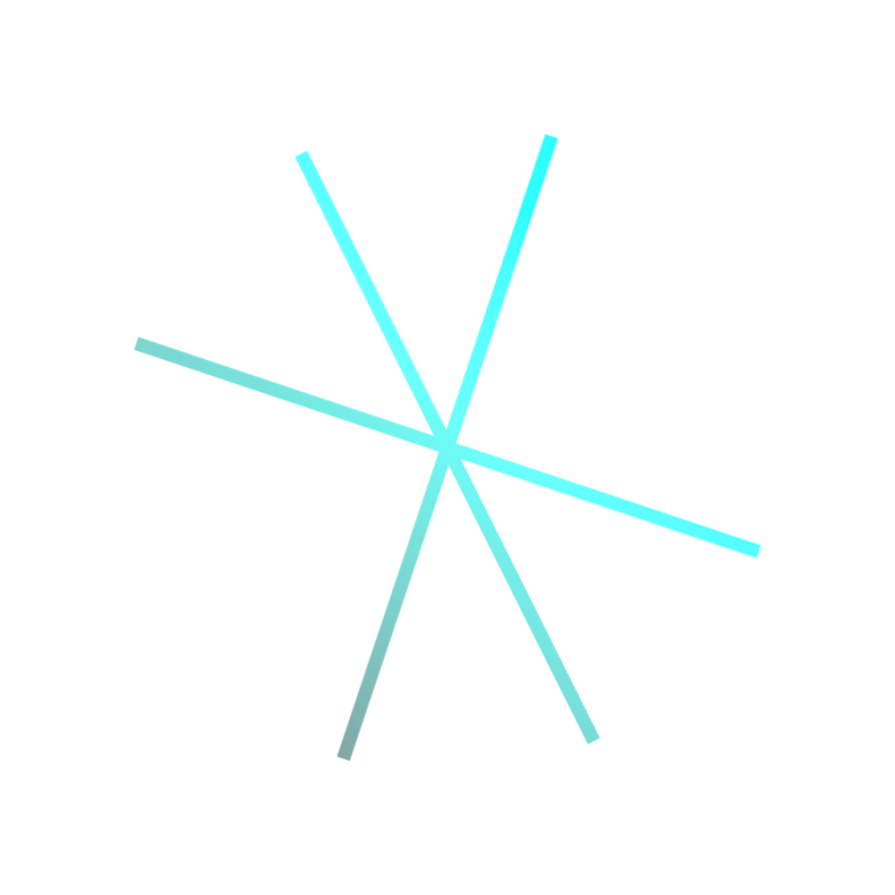

<div align="center">
    
    <h1>axist<sup>2</sup></h1>
    <p>
        
    </p>
    <p>Minimal (5kb) drop-in CSS library.</p>
    <br>
    <br>
    <br>
</div>

## Demo

[View demo](https://theresnotime.github.io/axist2/)

## Installation

Import in your HTML:

```html
<link rel="stylesheet" href="https://unpkg.com/@theresnotime/axist2/dist/axist.min.css"/>
```

With npm:

```bash
npm i @theresnotime/axist2

# import '../node_modules/@theresnotime/axist2/dist/axist.min.css'
```

## Acknowledgements
The codebase of axist<sup>2</sup> is based on [axist](#) by [Ruan Martinelli](https://github.com/ruanmartinelli), as is
the logo.